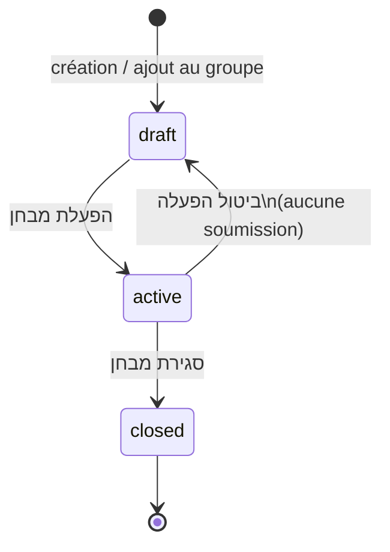

# Statuts d’un examen — flux et explications

Document de référence pour les **statuts affichés dans le tableau des examens** d’un cours (côté professeur) et le cycle de vie d’une **session** examen par groupe.

---

## 1. Contexte produit

### Examen vs session

| Concept | Rôle |
|--------|------|
| **מבחן (Exam)** | Modèle dans le catalogue : titre, questions, réglages généraux |
| **Session (`ExamSession`)** | Lien entre un examen et **une הרצה / groupe** (`offering_id`) — c’est elle qui porte le **statut** |
| **Tentative élève** | Indépendante : `non démarré` / `en cours` / `soumis` — ne figure pas dans la colonne « סטטוס » du tableau prof |

Le même examen peut exister dans le catalogue ; **chaque groupe** a sa propre session et donc son propre statut.

### Affichage dans l’interface (hébreu)

| Statut technique | Libellé UI |
|------------------|------------|
| `draft` | **טיוטה** |
| `active` | **המבחן פעיל** |
| `closed` | **המבחן נסגר** |

---

## 2. Les trois statuts

### 2.1 טיוטה (`draft`)

**Signification** : l’examen est préparé pour ce groupe ; **les élèves ne le voient pas** et ne peuvent pas le passer.

**Comment on y arrive**

- Création d’un examen depuis la page du cours (session brouillon créée automatiquement pour le `offering_id`)
- Ajout d’un examen existant au groupe (`attach-offering` + `ensure_draft_session`)
- **ביטול הפעלה** (annulation de l’activation) — **uniquement** si aucun élève n’a encore soumis

**Actions professeur**

| Action | Disponible |
|--------|------------|
| Éditer questions, titre, portée | Oui |
| Définir durée / alerte / הגשה אוטומטית | Au moment de **הפעלת מבחן** |
| **הפעלת מבחן** | Oui (si au moins une question) |
| Supprimer l’examen | Oui (si aucune session n’a quitté le brouillon ailleurs) |

**Édition** : `is_editable = true` tant qu’**aucune** session de cet examen n’est en statut `active` (une session `closed` sur un autre groupe n’bloque plus l’édition).

---

### 2.2 המבחן פעיל (`active`)

**Signification** : l’examen est **ouvert** pour ce groupe ; les élèves inscrits le voient et peuvent démarrer / soumettre.

**Comment on y arrive**

- Clic sur **הפעלת מבחן** : durée (`duration_minutes`), alerte avant fin (`warning_minutes`), הגשה אוטומטית (`auto_submit_on_timeout`), mode intégrité éventuel
- Les élèves approuvés reçoivent une notification

**Pendant cette phase**

| Règle | Détail |
|-------|--------|
| Édition du contenu | **Bloquée** tant qu’une session `active` existe (même sur un autre groupe) |
| Chronomètre | Démarre à l’acceptation des règles (intégrité) ou à la première ouverture |
| Réponses | Sauvegarde brouillon automatique ; soumission manuelle ou automatique à `expires_at` |

**Actions professeur**

| Action | Condition |
|--------|-----------|
| **סגירת מבחן** | Session active → passage à `closed`, résultats publiés |
| **ביטול הפעלה** | Session active **et** aucune soumission élève |
| Voir notes / résultats | Possible dès qu’il y a des tentatives |

---

### 2.3 המבחן נסגר (`closed`)

**Signification** : l’examen est **terminé** pour ce groupe ; plus de nouvelles soumissions ; **résultats publiés** (`results_published`).

**Comment on y arrive**

- **סגירת מבחן** par le professeur
- Fermeture automatique possible lorsque **tous** les inscrits approuvés ont soumis (logique `finalize_exam_submission`)

**Après clôture**

| Règle | Détail |
|-------|--------|
| Élèves | Ne peuvent plus passer ni soumettre |
| Édition examen | À nouveau possible (plus de session `active`) |
| ביטול הפעלה | Non applicable |

---

## 3. Diagramme des transitions (par groupe)

---

## 4. Résumé

| Statut | Hébreu UI | Élèves | Édition examen |
|--------|-----------|--------|----------------|
| `draft` | טיוטה | Non | Oui |
| `active` | המבחן פעיל | Oui | Non (si actif quelque part) |
| `closed` | המבחן נסגר | Non (terminé) | Oui |

---

## 5. Implémentation (référence code)

| Fichier | Rôle |
|---------|------|
| `backend/app/models/enums.py` | `ExamStatus`: `draft`, `active`, `closed` |
| `backend/app/models/exam.py` | Modèle `ExamSession.status` |
| `backend/app/services/exam_lifecycle.py` | `ensure_draft_session`, `exam_has_active_sessions` |
| `backend/app/routers/exams.py` | `activate`, `close`, `deactivate` |
| `frontend/src/config/courseExamTableColumns.tsx` | Colonne « סטטוס » (chips) |
| `frontend/src/components/ExamOfferingRowActions.tsx` | Boutons selon statut |

### Endpoints principaux

| Méthode | Route | Effet sur le statut |
|---------|-------|---------------------|
| `POST` | `/api/exams` (+ `offering_id`) | Crée examen + session `draft` |
| `POST` | `/api/exams/{id}/activate` | `draft` → `active` |
| `POST` | `/api/exams/sessions/{id}/close` | `active` → `closed` |
| `POST` | `/api/exams/sessions/{id}/deactivate` | `active` → `draft` (sans soumission) |

---

*Dernière mise à jour : aligné sur le comportement session brouillon à la création et édition bloquée uniquement si session `active`.*
