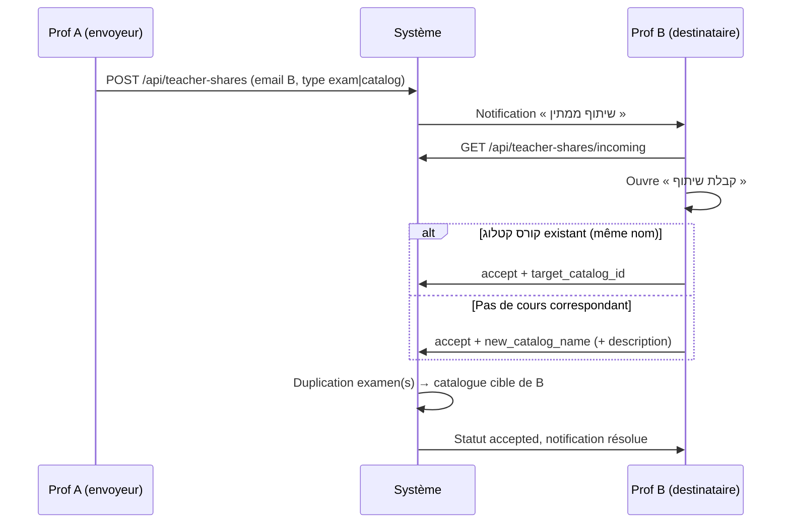

# Partage entre professeurs — flux et explications

Document de référence pour le partage de **מבחנים** (examens) et de **קורסי קטלוג** (cours catalogue) entre enseignants.

---

## 1. Contexte produit

### Application orientée « prof »

- Chaque professeur possède ses propres **קורסי קטלוג** (`teacher_id` sur `course_catalogs`).
- Les **מבחנים** et **תרגילים** sont rattachés au catalogue du prof.
- Les **הרצות** (instances : année, semestre, groupe / école) lient un catalogue à une classe réelle.
- **Il n’y a pas de contenu pédagogique commun** entre deux profs : pas de base partagée, pas de modification conjointe du même examen.

### Ce que le partage apporte

Les profs peuvent **échanger du contenu** sans fusionner leurs espaces : le destinataire reçoit une **copie** dans **son** catalogue, au catalogue qu’il choisit à l’acceptation.

---

## 2. Principe technique

| Élément | Comportement |
|--------|----------------|
| Lien entre profs | Enregistrement `teacher_content_shares` (statut `pending` → `accepted` / `declined`) |
| Données partagées | **Copie** (duplication questions + options + images) |
| Propriété après acceptation | 100 % chez le prof destinataire |
| Sessions / élèves | Non copiés — seul le contenu de l’examen |

---

## 3. Flux global



---

## 4. Envoi du partage (prof envoyeur)

### 4.1 Partager un מבחן

1. Depuis la liste des examens ou les actions sur une carte d’examen : **« שיתוף מבחן עם מורה »**.
2. Saisir l’**e-mail du professeur** destinataire (doit être un compte `teacher`).
3. Message optionnel.
4. Envoi → statut **ממתין** chez le destinataire.

**API :** `POST /api/teacher-shares`

```json
{
  "recipient_email": "prof.b@example.com",
  "share_type": "exam",
  "exam_id": 42,
  "message": "מבחן לדוגמה"
}
```

### 4.2 Partager un קורס קטלוג complet

1. Page **קורסי קטלוג** : bouton **שיתוף** à côté de chaque cours.
2. Même formulaire (e-mail + message).
3. **Tous les מבחנים** rattachés à ce catalogue seront proposés à la copie à l’acceptation.

**API :**

```json
{
  "recipient_email": "prof.b@example.com",
  "share_type": "catalog",
  "catalog_id": 7,
  "message": null
}
```

### 4.3 Règles à l’envoi

- Impossible de partager avec **soi-même**.
- Seul le **propriétaire** du examen / catalogue peut envoyer.
- Le destinataire doit exister en tant que **מורה** (e-mail enregistré).

---

## 5. Réception et acceptation (prof destinataire)

### 5.1 Où voir les partages

- Menu enseignant : **« שיתופים ממורים »** → `/teacher/shares`
- Onglet logique :
  - **שיתופים נכנסים** — à traiter
  - **שיתופים ששלחתי** — historique envoyé

### 5.2 Acceptation — choix du קורס קטלוג cible

C’est la réponse aux questions « dans quel cours du prof qui reçoit ? », « si le cours n’existe pas ? », « s’il existe ? ».

| Situation | Interface | Effet |
|-----------|-----------|--------|
| **Le prof B a déjà un catalogue du même nom** | Le système **présélectionne** ce cours (`suggested_catalog_id`) | Les examens copiés sont ajoutés **dans ce catalogue** |
| **Aucun catalogue adapté** | Option **« יצירת קורס קטלוג חדש »** | Création d’un `CourseCatalog` pour B, nom **prérempli** avec le nom du catalogue source (ou la matière de l’examen partagé) |
| **B préfère un autre catalogue existant** | Liste déroulante de **ses** קורסי קטלוג | Copie vers le catalogue choisi |

**API acceptation :** `POST /api/teacher-shares/{id}/accept`

Vers un catalogue existant :

```json
{ "target_catalog_id": 12 }
```

Création d’un nouveau catalogue :

```json
{
  "new_catalog_name": "מבני נתונים",
  "new_catalog_description": "מועתק מפרופ א"
}
```

### 5.3 Résultat de l’acceptation

**Partage d’un examen :**

- Une copie de l’examen dans le catalogue cible.
- Titre suffixé : `(משותף)` (ex. « מבחן 1 (משותף) »).
- `scope_teacher_id` = prof B ; année / semestre / groupe remis à vide (B les définit pour ses הרצות).
- Statut : brouillon, sans session active.

**Partage d’un cours catalogue :**

- Pour **chaque** examen du catalogue source : même logique de copie vers le catalogue cible.
- Les titres des examens sont **conservés** (pas de suffixe obligatoire sur chaque titre en mode catalogue).

### 5.4 Refus

`POST /api/teacher-shares/{id}/decline` → statut `declined`, aucune copie.

---

## 6. Inscription élève (rappel — hors partage)

Flux distinct, pour contexte :

| Méthode | Description |
|---------|-------------|
| E-mail du prof | `/student/join-course` — liste des cours **ouverts** de ce prof uniquement |
| QR / lien | `/join/t/{token}` — jeton avec **expiration** ; renouvellement par le prof |
| Partage prof→prof | Ne concerne **pas** les élèves |

---

## 7. Modèle de données (partage)

Table `teacher_content_shares` :

| Champ | Rôle |
|-------|------|
| `sender_id` | Prof envoyeur |
| `recipient_id` | Prof destinataire |
| `share_type` | `exam` ou `catalog` |
| `status` | `pending`, `accepted`, `declined` |
| `source_exam_id` | Si partage d’un examen |
| `source_catalog_id` | Si partage d’un catalogue |
| `target_catalog_id` | Catalogue cible après acceptation |
| `message` | Note optionnelle de l’envoyeur |
| `created_at` / `resolved_at` | Horodatage |

Migration : `014_teacher_content_shares` (après `013` pour `join_token` sur les הרצות).

---

## 8. API résumée

| Méthode | Route | Rôle |
|---------|-------|------|
| `POST` | `/api/teacher-shares` | Créer un partage |
| `GET` | `/api/teacher-shares/incoming` | Partages reçus |
| `GET` | `/api/teacher-shares/sent` | Partages envoyés |
| `POST` | `/api/teacher-shares/{id}/accept` | Accepter + choix catalogue |
| `POST` | `/api/teacher-shares/{id}/decline` | Refuser |

Rôle requis : **teacher**.

---

## 9. Fichiers code principaux

### Backend

- `app/models/teacher_share.py`
- `app/services/teacher_share_service.py`
- `app/services/exam_lifecycle.py` — `duplicate_exam_to_catalog()`
- `app/routers/teacher_shares.py`
- `alembic/versions/014_teacher_content_shares.py`

### Frontend

- `components/ShareWithTeacherDialog.tsx` — envoi
- `components/AcceptTeacherShareDialog.tsx` — acceptation + choix catalogue
- `pages/teacher/TeacherSharesPage.tsx` — liste incoming / sent
- `components/ExamActionButtons.tsx` — bouton partage examen
- `pages/teacher/TeacherCatalogCoursesPage.tsx` — boutons partage catalogue

### i18n

Clés dans `frontend/src/i18n/he.ts` : `shareExam`, `shareCatalog`, `teacherShares`, `acceptShare`, etc.

---

## 10. Ce qui n’est **pas** partagé

- הרצות (instances de cours) et inscriptions élèves
- Sessions d’examen activées, tentatives, notes
- Paramètres de lien / QR d’inscription
- Exercices du catalogue (seuls les **מבחנים** sont copiés dans le flux « cours catalogue » actuel)

---

## 11. Déploiement

```bash
cd backend
alembic upgrade head
```

Vérifier que les migrations `012` (join token), `013` (catalog `teacher_id`) et `014` (shares) sont appliquées.

---

## 12. Évolutions possibles (non implémentées)

- Partager aussi les **תרגילים** d’un catalogue
- Prévisualisation du contenu avant acceptation
- Partage vers plusieurs profs en une fois
- Synchronisation (mise à jour si la source change) — aujourd’hui **copie figée** uniquement
